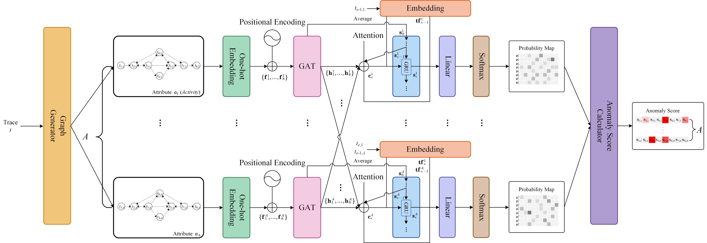
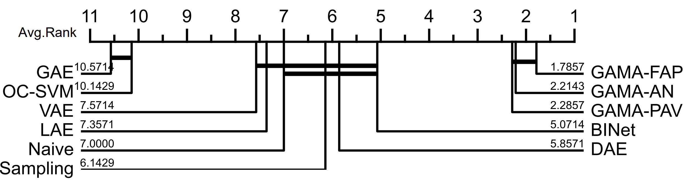
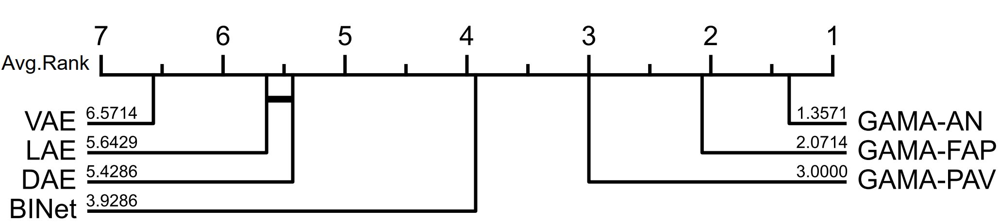

# GAMA: A Multi-graph-based Anomaly Detection Framework for Business Processes via Graph Neural Networks
This is the source code of our paper '**GAMA: A Multi-graph-based Anomaly Detection Framework for Business Processes via Graph Neural Networks**'.


## Requirements
- [PyTorch==1.13.0](https://pytorch.org)
- [NumPy==1.23.5](https://numpy.org)
- [scikit-learn==1.2.1](https://scikit-learn.org)
- [pm4py==2.6.1](https://pm4py.fit.fraunhofer.de/)
- [PyG==2.1.0](https://pytorch-geometric.readthedocs.io/en/latest/index.html)
- [pandas==1.5.3](https://pandas.pydata.org/)

## Using Our Code
```
    python main.py --mode eval --TF FAP
```

Two modes have been implemented:

- _eval_:  Utilizing the anomalous event logs located in the _**eventlogs**_ folder to obtain evaluation results (For reproducibility of the experiments).
- _test_: Detecting anomalies in the event log with the 'xes' format and obtaining anomaly detection results (For practical application).

Three teacher forcing (TF) styles have been implemented:
- _AN_:  We consider that the current attribute value depends mainly on the current activity name. Therefore, at current event , the ground truth activity name is used to guide the prediction of the probability distribution.
- _PAV_: We consider that the current attribute value depends mainly on the previous attribute value. Therefore, the previous ground truth attribute value  is used to guide the prediction of the  probability distribution.
- _FAP_:  We consider that the current attribute value depends both on the current activity name and the previous attribute value. Therefore, the  fusion of current ground truth activity name and the previous ground truth attribute value is used to guide the prediction of the  probability distribution.


## Datasets
Six commonly used real-life logs:

i) **_Billing_**: This log contains events that pertain to the billing of medical services provided by a hospital.

ii) **_Receipt_**: This log contains records of the receiving phase of the building permit application process in an anonymous municipality.

iii) **_Sepsis_**: This log contains events of sepsis cases from a hospital.

iv)  **_RTFMP_**: Real-life event log of an information system managing road traffic fines.

v) **_Permit_**:  it contains events related to travel permits (including all related events of relevant prepaid travel cost declarations and travel declarations).

vi) **_Declaration_**: it contains events related to international travel declarations.

Eight synthetic logs: i.e., **_Paper_**,  _**P2P**_, **_Small_**, **_Medium_**, **_Large_**, **_Huge_**, **_Gigantic_**, and **_Wide_**.

The summary of statistics for each event log is presented below:

| Log            | #Activities    | #Traces    | #Events         | Max trace length       | Min trace length    | #Attributes    | #Attribute values  |
|:--------------:|:--------------:|:----------:|:---------------:|:----------------------:|:-------------------:|:--------------:|:------------------:|
| Gigantic       | 76-78          | 5000       |  28243-31989    | 11                     | 3                   |  1-4           |  70-363            |
| Huge           | 54             | 5000       |  36377-42999    | 11                     | 5                   |  1-4           |  69-340            |
| Large          | 42             | 5000       |  51099-56850    | 12                     | 10                  |  1-4           |  68-292            |
| Medium         | 32             | 5000       |  28416-31372    | 8                      | 3                   |  1-4           |  66-276            |
| P2p            | 13             | 5000       |  37941-42634    | 11                     | 7                   |  1-4           |  39-146            |
| Paper          | 14             | 5000       |  49839-54390    | 12                     | 9                   |  1-4           |  36-128            |
| Small          | 20             | 5000       |  42845-46060    | 10                     | 7                   |  1-4           |  39-144            |
| Wide           | 23-34          | 5000       |  29128-31228    | 7                      |  5-6                |  1-4           |  53-264            |
| Billing        | 18             | 100000     | 451359          | 217                    | 1                   | 0              | 0                  |
| Receipt        | 27             | 1434       | 8577            | 25                     | 1                   | 2              | 58                 |
| Sepsis         | 16             | 1050       | 15214           | 185                    | 3                   | 1              | 26                 |
| RTFMP          | 11             | 150370     | 561470          | 20                     | 2                   | 0              | 0                  |
| Permit         | 51             | 7065       | 86581           | 90                     | 3                   | 2              | 10                 |
| Declaration    | 34             | 6449       | 72151           | 27                     | 3                   | 2              | 10                 |

Logs containing artificial anomalies ranging from 5% to 45% are stored in the folder '**_eventlogs_**'. The file names are formatted as _log_name_-_anomaly_ratio_-_ID_.

## Experiment Results
Critical difference diagram over trace-level anomaly detection:

Critical difference diagram over attribute-level anomaly detection:


_F−scores_  over synthetic logs where 'T' and 'A'  represent trace- and attribute-level anomaly detection respectively.

|         | Paper       | Paper       | P2P         | P2P         | Small       | Small       | Medium      | Medium      | Large       | Large       | Huge        | Huge        | Gigantic    | Gigantic    | Wide        | Wide         |
|:-------:|:-----------:|:-----------:|:-----------:|:-----------:|:-----------:|:-----------:|:-----------:|:-----------:|:-----------:|:-----------:|:-----------:|:-----------:|:-----------:|:-----------:|:-----------:|:------------:|
|          | T                | A                | T                | A                | T                | A                | T                | A                | T                | A                | T                | A                | T                | A                | T                | A                |
| OC-SVM   | 0.498            | -                | 0.48             | -                | 0.522            | -                | 0.446            | -                | 0.48             | -                | 0.446            | -                | 0.462            | -                | 0.46             | -                |
| Naive    | 0.866            | -                | 0.85             | -                | 0.898            | -                | 0.691            | -                | 0.715            | -                | 0.69             | -                | 0.574            | -                | 0.779            | -                |
| Sampling | 0.901            | -                | 0.886            | -                | 0.896            | -                | 0.86             | -                | 0.91             | -                | 0.89             | -                | 0.8              | -                | 0.888            | -                |
| GAE      | 0.472            | -                | 0.559            | -                | 0.468            | -                | 0.449            | -                | 0.53             | -                | 0.429            | -                | 0.434            | -                | 0.561            | -                |
| DAE      | 0.799            | 0.468            | 0.767            | 0.475            | 0.829            | 0.463            | 0.713            | 0.436            | 0.747            | 0.433            | 0.691            | 0.415            | 0.58             | 0.288            | 0.753            | 0.455            |
| VAE      | 0.828            | 0.19             | 0.655            | 0.212            | 0.788            | 0.219            | 0.637            | 0.23             | 0.772            | 0.201            | 0.589            | 0.213            | 0.495            | 0.181            | 0.64             | 0.23             |
| LAE      | 0.678            | 0.243            | 0.666            | 0.266            | 0.748            | 0.239            | 0.584            | 0.27             | 0.571            | 0.25             | 0.531            | 0.268            | 0.504            | 0.234            | 0.699            | 0.271            |
| BINet    | 0.543            | 0.33             | 0.557            | 0.342            | 0.566            | 0.358            | 0.521            | 0.319            | 0.549            | 0.333            | 0.526            | 0.331            | 0.525            | 0.32             | 0.551            | 0.345            |
| GAMA-AN  | **0.949**        | <u>**0.701**</u> | **0.950**        | <u>**0.686**</u> | **0.955**        | <u>**0.717**</u> | **0.873**        | <u>**0.716**</u> | **0.945**        | <u>**0.768**</u> | **0.916**        | <u>**0.763**</u> | **0.821**        | <u>**0.701**</u> | **0.921**        | <u>**0.724**</u> |
| GAMA-PAV | <u>**0.976**</u> | **0.675**        | <u>**0.974**</u> | **0.664**        | <u>**0.981**</u> | **0.663**        | <u>**0.903**</u> | **0.654**        | **0.944**        | **0.678**        | **0.909**        | **0.663**        | **0.809**        | **0.614**        | <u>**0.950**</u> | **0.670**        |
| GAMA-FAP | **0.955**        | **0.699**        | **0.949**        | **0.683**        | **0.955**        | **0.708**        | **0.872**        | **0.700**        | <u>**0.947**</u> | **0.752**        | <u>**0.922**</u> | **0.750**        | <u>**0.833**</u> | **0.691**        | **0.923**        | **0.712**        |


_F−scores_  over real-life logs where 'T' and 'A'  represent trace- and attribute-level anomaly detection respectively.

|          | Billing          | Billing          | Receipt          | Receipt          | Sepsis           | Sepsis           | RTFMP            | RTFMP            | Permit           | Permit           | Declaration      | Declaration      |
|:--------:|:----------------:|:----------------:|:----------------:|:----------------:|:----------------:|:----------------:|:----------------:|:----------------:|:----------------:|:----------------:|:----------------:|:----------------:|
|          | T                | A                | T                | A                | T                | A                | T                | A                | T                | A                | T                | A                |
| OC-SVM   | 0.34             | -                | 0.464            | -                | 0.415            | -                | 0.507            | -                | 0.405            | -                | 0.449            | -                |
| Naive    | 0.668            | -                | 0.638            | -                | 0.392            | -                | 0.776            | -                | 0.462            | -                | 0.495            | -                |
| Sampling | 0.701            | -                | 0.647            | -                | 0.391            | -                | 0.721            | -                | 0.458            | -                | 0.507            | -                |
| GAE      | 0.385            | -                | 0.42             | -                | 0.391            | -                | 0.341            | -                | 0.386            | -                | 0.406            | -                |
| DAE      | 0.754            | 0.444            | 0.65             | 0.158            | 0.461            | 0.136            | 0.865            | 0.498            | 0.522            | 0.182            | 0.576            | 0.201            |
| VAE      | 0.731            | 0.435            | 0.524            | 0.134            | 0.448            | 0.172            | 0.813            | 0.517            | 0.484            | 0.188            | 0.476            | 0.18             |
| LAE      | 0.784            | 0.509            | 0.526            | 0.218            | 0.408            | 0.126            | 0.874            | 0.505            | 0.486            | 0.287            | 0.514            | 0.345            |
| BINet    | 0.621            | 0.442            | 0.575            | 0.416            | 0.435            | 0.192            | 0.744            | 0.493            | 0.641            | 0.423            | 0.678            | <u>**0.499**</u> |
| GAMA-AN  | **0.792**        | **0.545**        | **0.763**        | <u>**0.548**</u> | **0.570**        | <u>**0.457**</u> | **0.899**        | **0.534**        | <u>**0.682**</u> | <u>**0.428**</u> | <u>**0.727**</u> | 0.461            |
| GAMA-PAV | **0.791**        | **0.544**        | <u>**0.778**</u> | **0.538**        | **0.510**        | **0.376**        | **0.914**        | **0.574**        | 0.634            | 0.369            | 0.669            | 0.406            |
| GAMA-FAP | <u>**0.811**</u> | <u>**0.548**</u> | **0.752**        | **0.535**        | <u>**0.573**</u> | **0.450**        | <u>**0.914**</u> | <u>**0.576**</u> | **0.679**        | 0.402            | **0.718**        | 0.444            |


